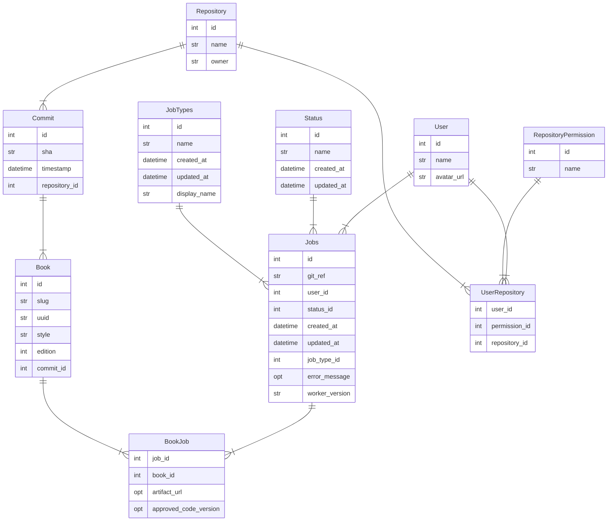

# Content Output Review and Generation Interface (CORGI)


_FKA: "CORGI", Content Output Review and Generation Interface_

---
- **What does CORGI do? 🤔**
  [Check out the high level docs](https://openstax.atlassian.net/wiki/spaces/CE/pages/2017918977/CORGI+Service)

- **I'd like to read the detailed docs 🤓**
  [Read The Docs](https://corgi.readthedocs.org/)

- **I'm ready to install and run CORGI 🚀**
  [Installation](#development-internals)

## Summary

The CORGI system consists of 2 parts:

1. CORGI Job Dashboard
2. [Enki](https://github.com/openstax/enki) Pipeline

### CORGI Job Dashboard

The CORGI Job Dashboard or "CORGI dashboard" consists of a front-end microservice and a backend microservice. The CORGI Dashboard acts mainly as a "queue" of jobs to be processed by the Enki Concourse pipeline.

1. Backend - written using Python and the [FastAPI ASGI Framework](https://fastapi.tiangolo.com/). The backend API is used by the front-end and Enki pipelines to create, retrieve, or update job information.

2. Frontend - written using [svelte](https://svelte.dev/) and acts as the main dashboard interface of the CORGI system. You can see the list of jobs, create jobs, or abort a job that's in progress. Shows information pertaining to errors and status.

### [Enki](https://github.com/openstax/enki)

Enki produces the Concourse pipeline configuration files that are used to build book artifacts. Book artifacts can be pdf files, web preview links, docx, etc. Concourse uses "workers" that watch for new jobs created using the CORGI job dashboard. The Concourse pipeline reads the jobs from the CORGI backend and updates the job status and upon completion updates the job with links to the respective book artifact that was produced.

The full explanation of Enki it is out of scope for this documentation. To learn more please reference the [Enki README.md](https://github.com/openstax/enki/blob/main/README.md) within the project.

---
## Development Internals

### Installing Docker

* Install [Docker](https://docs.docker.com/install/).

* Install [Docker Compose](https://docs.docker.com/compose/install/).

> **A note for Mac and PC users**
> After installing Docker, navigate to the Docker Desktop GUI preferences and increase the `Memory` value to at least `8GiB`.
> [Here's where you can find the Docker Desktop GUI settings](https://docs.docker.com/docker-for-windows/#resources)


## Local development

**General Workflow**
1. Start stack with or without GitHub OAuth (see below)
1. Visit http://localhost/ to see the frontend
1. Make modifications
1. Wait for automatic reload

**NOTE**: You might get 502 when visiting http://localhost/ at first: this is normal. Wait a few seconds and try again.

### GitHub OAuth Disabled (Leashed Mode)

To start corgi without GitHub OAuth, in the project root directory, run:

```bash
./corgi start-leashed
```

or

```bash
./corgi start
```

then you can initialize the database with sample data by running

```bash
./corgi create-jobs
```

In leashed mode, corgi only uses data that is stored locally.

Currently, that data is stored in `backend/app/tests/unit/data`.

**NOTE:** By default, you will only be able to use `tiny-book` as the repository and `book-slug1` as the book when queuing jobs. This data can be updated: see [Run backend unit tests](#run-backend-unit-tests) for more information.

### GitHub OAuth Enabled

**Prerequisites**
* You will need access to a GitHub OAuth app. You can [create your own](https://docs.github.com/en/developers/apps/building-oauth-apps/creating-an-oauth-app) if you do not have one already.
* Create an env file, `backend/app/app/core/.env`, with two entries:
    1. `GITHUB_OAUTH_ID` (your oauth app client id)
    2. `GITHUB_OAUTH_SECRET` (your oauth app client secret)

Build/start the stack with the Corgi script:

```bash
./corgi start-dev
```

View the API Docs here:

* http://localhost/docs (Swagger)
* http://localhost/redoc (ReDoc)

To check the logs run:

```bash
./corgi logs backend/frontend/etc.
```

### Functions Patched in Leashed Mode

Leashed mode attempts to patch any `app.github.api` function functions starting with `get_`. It looks for the associated mock functions in `backend/app/tests/unit/init_test_data.py`.

### Hot Reloading

Using the development stack, the Svelte frontend is rebuilt inside the container
as you make changes: no restarts required. The page should reload automatically
as well. The same is true for the backend: as you make modifications, the
backend server should reload with your latest changes.

### Run backend unit tests

To run unit tests:

```bash
cd backend/app
poetry run pytest tests/unit
```

The unit tests use vcr to store response from GitHub. To update the test data:

```bash
cd backend/app
poetry run pytest tests/unit --init-test-data --github-token "<token>"
```

### Run integration and UI tests

To run the tests execute:

```bash
./corgi ui-tests <BASE_URL> <TOKEN>

# Run UI tests on staging
# IMPORTANT: no trailing slash
./corgi ui-tests https://corgi-staging.ce.openstax.org <github-token>

# Run UI tests on localhost (see note)
./corgi ui-tests http://host.docker.internal fake-token
```

**NOTE**: `host.docker.internal` refers to the host machine's `localhost` instead of the container's (see [documentation](https://docs.docker.com/desktop/networking/#use-cases-and-workarounds-for-all-platforms) for more info). The ui tests will still fail if CORGI is running in leashed mode because of how the the github api calls are patched. If you want the ui tests to work locally, you will need to configure the
OAuth credentials accordingly and run CORGI in dev mode.

### How to develop UI tests

Playwright UI tests are stored in `backend/app/tests/ui`.

### Clear the database

Start the stack as described above

Run the reset-db command that is contained in the `manage.py` file.

    docker-compose exec backend python manage.py reset-db

### Migrations

Automatic migration files can be generated for the database. After a change is made you'll want to create a new revision.

Make sure the stack is running in development mode.

Enter the backend Docker container:

    docker-compose exec backend bash

Create a revision:

    docker-compose exec backend alembic revision --autogenerate -m "added new column X"

A new revision will be added in the [migration](./backend/app/migrations/versions) folder.

Open the file and ensure the changes are what you expect.

Do the migration:

    docker-compose exec alembic upgrade head

### Load testing for the backend (Under Construction)

*UNDER CONSTRUCTION*

Load testing with Locust.io is in the directory `./backend/app/tests/performance/`

Please look at the [README](./backend/app/tests/performance/README.md) in this directory on how to run load tests locally and for production systems.

## Sphinx Documentation

### View the Docs

For our documentation we use [Sphinx-docs](https://www.sphinx-doc.org/en/master/)
and lives in the [./docs](./docs) directory.

If you are currently running the entire stack you should be able to see the
documentation by visiting [http://localhost:8000](http://localhost:8000).

The documentation is configured to watch for changes and re-build the documentation.
This allows developers the ability to preview their documentation changes as they
make them.

If you would like to run the documentation without the entire stack running you
can do so by running:

    docker-compose up docs

### Editing The Docs

Edits are done in restructured text (rst).

While editing, you can check the logs by running
```
$ ./corgi docs logs
```
or
```
$ ./corgi docs logs -f
```

If edits have been made to the Navigation and are not reflected, re-build the docker image:
```
$ ./corgi build <stack-name>
$ ./corgi start [stack-name]
```

### Auto-generated docs

Additional documentation is automatically pulled from this README and added to the sphinx docs when the docs service is running and when corgi.readthedocs.io is deployed. Each level 2 header (##) becomes a separate page in the sphinx docs. Links, like [README.md](./README.md), are resolved to github links relative to the markdown file's parent directory.

This documentation is stored in [docs/auto](./docs/auto) and this directory should not be modified directly. It is saved as markdown and converted with the m2r2 sphinx extension (see [conf.py](./docs/conf.py) for more information).

When the files are generated, they are numbered so that the glob result will match the order the headers occurred in within the README.

The `docs` docker image uses [watchdog](https://pypi.org/project/watchdog/) to automatically update the auto-generated documentation as you update [README.md](./README.md).

There is a pre_build step in [.readthedocs.yaml](./.readthedocs.yaml) that generates the documentation during deployment.


## Releasing

The documentation is located in the [Releasing CORGI article](https://openstax.atlassian.net/wiki/spaces/CE/pages/1256521739/Releasing+CORGI) in our Confluence documentation.

## Deploying Web Hosting Pipeline

The documentation is located in the [How to Deploy Web Hosting Pipeline article](https://openstax.atlassian.net/wiki/spaces/CE/pages/573538307/Deploying+the+web-hosting+pipeline) in our Confluence Documentation.
## Attribution

A lot of the structure and ideas for this service come from Tiangolo's [full-stack-fastapi-postgres](https://github.com/tiangolo/full-stack-fastapi-postgresql) project with additional supporting software and ideas from [authlib](https://docs.authlib.org/en/latest/client/fastapi.html). Thanks Tiangolo and Authlib devs!

## Login with GitHub Personal Access Token (PAT)
For situations where it is difficult or impossible to login with a username and password, there is an alternative way to login with a GitHub PAT. To utilize this functionality:

**Note:** the same restrictions apply to users regardless of login method (i.e. you do not gain additional permissions by logging in with a token).

1. Create a GitHub PAT with at least the `read:user`, `read:org`, and `repo` scopes.
2. Make a request to `/api/auth/token-login` with an additional header: `Authorization: Bearer <your-token>`
3. Get the session cookie from the `set-cookie` header in the response.
4. Make additional response with the session cookie.

### Example

```python
import os

import requests

# Note: This example assumes you are running CORGI locally

my_token = os.environ["TOKEN"]  # Don't hardcode secrets ;)

with requests.session() as session:
    response = session.get(
        "http://localhost/api/auth/token-login",
        headers={"Authorization": f"Bearer {my_token}"})
    assert response.cookies.get("session", None) is not None, \
           "Could not get session cookie"
    # Now your cookie will be used to make requests that require a valid user
    # session
    jobs = session.get("http://localhost/api/jobs")
    print(jobs.json())
```

## Testing Unmerged CORGI & Enki Changes in Concourse

[CORGI Hotdog](https://corgi-hotdog.ce.openstax.org/) is a testing environment for experimenting with changes before they go to staging.

URL: https://corgi-hotdog.ce.openstax.org/

### Use cases for hotdog
- Catching issues that do not appear on Enki GitHub actions but does error in Concourse
- Experimenting with changes that would be difficult/tedious to test locally (changes to concourse resource, upload steps, etc.)

### Deploy Porcess

- Two ways to deploy changes
    - https://corgi-hotdog.ce.openstax.org/hotdog
        * Enter the ref for one or both repos into the fields (ref can be commit sha or branch name)
    - There is a script in [ce-scripts](https://github.com/openstax/ce-scripts/blob/c6c2e63d8941392003a4462c8a73e86aa06a598e/bash/hotdog)
        * Run this script in Enki or CORGI.
        * You can either specify a ref as an argument to the script or use your current ref by omitting this argument.
- At this point, the two ways converge and the following occurs
    - Success message
    - On concourse, corgi-hotdog, wait for hotdog-head to get new checked out version, this triggers a concourse build pipeline is set in build-deploy-Enki
        - See api call: `corgi-hotdog.openstax.org/hotdog/head` if you would like more details
    - Since concourse depends on production Enki tags on dockerhub, there isn’t a way to do concourse + dev Enki tag — except thru hotdog
    - Hotdog tag on dockerhub: corgi-hotdog rebuild as whatever dev ref you give it, then rebuilds the docker image for Enki.
        - Rebuild triggered by submitting a new ref.
    - Wait to build hotdog tag and push to dockerhub. At this point, you can create a job. still have to wait for concourse (steps: corgi-git-pdf & corgi-resource) to fetch the tag. then eventually the job will run.
- Some additional details are
    - If you checkout a branch, you will need to checkout the branch again if you want to pull the latest changes from the branch
    - Jobs run on concourse. See logging & progress details on concourse/CORGI.
    - In hotdog corgi ui: worker-version tells you what Enki ref it is & a timestamp
    - Only one corgi-hotdog tag at a time

### Hotdog TODO
1. Automatically pull changes from branches
1. Automatically redeploy the stack if python dependencies change (maybe add a field to corgi refs that, when set, will trigger deploy on checkout?)
1. Consider creating a hybrid of PR pipeline so each PR can have a hotdog stack

## Generating an ERD

The corgi CLI supports generating an ERD from database data. The auto-generated ERD, as well as a small description, replaces the README section labeled `## CORGI ERD`.

### Running the script
Assuming you have the CORGI stack running and you are in the root of the repository, you can generate an ERD like this:
```bash
# Create some sample data if you have not already
./corgi create-jobs
# Generate the ERD and update the README
./corgi create-erd
```

### How it works

This will run the [generate-erd](./scripts/generate-erd.py) script which attempts to crawl all database entities, starting with `Jobs` entity, and collect information about their fields and relationships. From this, the script generates an ERD using mermaid diagram syntax. An awk script replaces the section in the README with the newly generated ERD.

### Limitations (TODO?)

* Does not specify which fields are primary or foreign keys
* When an optional field is None, it cannot infer the data type (uses `opt` as placeholder type)
* Annoyingly, in mermaid ERD syntax `relationship-label` is [required](https://mermaid.js.org/syntax/entityRelationshipDiagram.html#entities-and-relationships). Since that is non-trivial to auto-generate, it is set to "" (empty string).

## CORGI ERD

[comment]: <> (BEGIN AUTO-GENERATED SECTION - CORGI ERD)
This section describes the data model used by CORGI. For more information
about how to read this diagram, see [Crow's foot notation](https://en.wikipedia.org/wiki/Entity%E2%80%93relationship_model#Crow's_foot_notation).

[comment]: <> (END AUTO-GENERATED SECTION - CORGI ERD)
