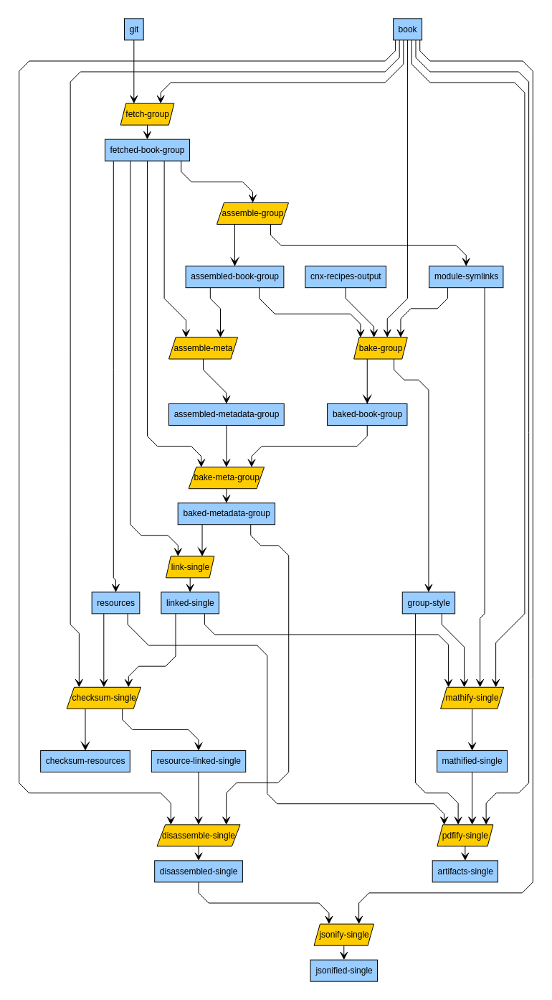

## Bakery Concourse Pipeline Config Generator and Bakery CLI

This directory contains the code necessary to both generate and run our content distribution and cops pipelines, either in individual steps or as a whole. Effort has been put in to paramaterize code pieces so that:
- A downstream user (user of the Bakery CLI)
- A developer making pipeline changes or debugging
- A production or staging node
- A CI node running tests

will all be reusing the same code, give or take some configuration.

### Bakery CLI

#### Dependencies
To use the CLI, you must have all of the following already installed:
- docker
- docker-compose
- node >= 12.16.1
- npm

getting the above software installed is outside the scope of this documentation.

#### Installation
For installation inside the `output-producer-service` directory: 

A simple `npm install`

To install the npm package:

`npm -g i @openstax/bakery-cli`

#### Usage
For now, when inside `/bakery` the file `src/cli/execute.js` is the entry point for the CLI, and must be called as an argument to `node` e.g. `node ./src/cli/execute.js`. Calling it without arguments will yield a help message. Each task in the pipeline should have a corresponding subcommand in this CLI so that one may run it individually and locally.

For example, to fetch a book and have its contents appear in the directory `/tmp/data`, one could use the following command, with `bakery` as their working directory:

`node ./src/cli/execute.js run fetch -d /tmp/data staging.cnx.org col30149 latest`

When using the npm package, `bakery` is the entry point for the CLI. Calling it without arguments will yield a help message. 
Calling `bakery run` will yeild all possible subcommands in this CLI. 

For example, to fetch a book and have its contents appear in the directory `/data/prealgebra-2e`, one could use the following command:

`bakery run fetch katalyst01.cnx.org col30939 latest -d ./data/prealgebra-2e`

To assemble the book: 

`bakery run assemble col30939 -d ./data/prealgebra-2e`

To link extras: 

`bakery run link-extras col30939 archive.cnx.org -d ./data/prealgebra-2e`

To bake the book: 

`bakery run bake col30939 {path-to-recipe} {path-to-style} -d ./data/prealgebra-2e/`

To mathify the book: 

`bakery run mathify col30939 -d ./data/prealgebra-2e/`

To build the PDF: 

`bakery run build-pdf col30939 -d ./data/prealgebra-2e/`

### New Git-Storage Compatible Tasks
Git-storage compatible tasks are not ready for use outside of the CE Tech yet.
The following graph represents the (almost) current state of git-storage compatible tasks. Intermediate states are shown in blue, tasks in yellow.
This graph is created with yED and the source file for it is located [here](./docs/pipelines.graphml).




The bake-group, assemble-group, bake-meta-group and assemble-meta-group tasks can be run with the --single flag to only process a single book. If the full book group has not been run through all these tasks, this flag is mandatory for running the link-single task.

### Bakery Concourse Pipeline Config Generator

#### Dependencies
- node >= 12.16.1
- npm

#### Setup
A simple `npm install`

#### Usage
`build` is an executable that provides a small cli to build your concourse pipeline/task files. This is the help message returned by calling it with `./build --help`:
```
./build <command>

Commands:
  build.js pipeline <pipelinetype> [options] <env> [options]...  builds a bakery pipeline runnable with fly command
  [aliases: p]
  build.js task <taskname> [options]...  builds a bakery pipeline task runnable with fly execute                    [aliases: t]

Options:
  --help  Show help                                                                                  [boolean]
```

In general, for both the `pipeline` and `task` commands, the `--help` messages are fairly useful and complete. That is:

`./build pipeline --help`

and

`./build task --help`

will provide information about the command, defaults, and its positional and nonpositional arguments.

When generating pipelines for the local environment, the following environment variables are used for credentials:

| Environment variable | Required to be set (may be empty string if desired) | Notes |
| -------------------- | -------- | ----- |
| `AWS_ACCESS_KEY_ID` | Yes | AWS credentials (likely for our sandbox) |
| `AWS_SECRET_ACCESS_KEY` | Yes | AWS credentials (likely for our sandbox) |
| `DOCKERHUB_USERNAME` | No | Your Docker Hub credentials (only needed if you're hitting rate limits otherwise) |
| `DOCKERHUB_PASSWORD` | No | Your Docker Hub credentials (only needed if you're hitting rate limits otherwise) |
| `GH_SECRET_CREDS` | Yes | A GitHub personal access token. |

#### Generate a pipeline file for a particular environment
Run `./build pipeline <pipelinetype> [options] <env> [options]...`

The choices for `<pipelinetype>` are the basenames of the `.js` files in the `src/pipelines/` directory.

The choices for `<env>` are the basenames of the `.json` files in the `env/` directory.

Examples:
- `./build pipeline distribution prod` -> Build the distribution pipeline with prod environment variables and output on stdout.
- `./build pipeline cops staging -o cops-pipeline.staging.yml` -> Build the cops pipeline with staging environment variables and output to file `cops-pipeline.staging.yml`, overwriting the file if it exists.

#### Generate a standalone task file suitable for `fly execute`
Run `./build task <taskname> [options]...`

The choices for `<taskname>` are the basenames of the `.js` files in the `src/tasks/` directory.

Example:
- `./build task look-up-book -a "{bucketName: my-bucket}"` -> Build the look-up-book task, injecting the object `{bucketName: "my-bucket"}` as the argument to the task function, and output the result to stdout
- `./build task fetch-book -o fetch-book-task.yml` -> Build the fetch-book task, and output the result to the file `fetch-book-task.yml`

Note: The `--args` option (shorthand, `-a`) must be valid `yaml` (or `json`, since yaml is a superset).

#### I don't like generating intermediate files to run `set-pipeline` or `execute`!
Use process substitution!
Example: `fly -t dev sp -p bakery -c <(./build pipeline cops staging)`

### Development and QA

#### Tip for development

The Bakery CLI allows the user to specify an `image_resource` for concourse to run the task in instead of the default. This is especially useful for either developing locally on the cops-bakery-scripts or perhaps being able to use the checked out code to create an image rather than using the image on Docker Hub when running tests. There is some specific convention for how to do this sort of thing.

For example, if one wanted to make changes to cops-bakery-scripts and have those changes reflect in the CLI running locally, one would have to follow these steps:
1. Have `src/scripts` as your working directory
2. Make the desired change in the `src/scripts/*.py` file
3. Build the image with `docker build .`
4. Tag the build image as `localhost:5000/openstax/cops-bakery/scripts:latest` (the prefix of `localhost:5000` is *required*, what you name and tag your image is up to you), for example, with `docker tag $(docker image ls | awk 'NR==2 {print $3}') localhost:5000/openstax/cops-bakery-scripts:latest`
5. Run the desired pipeline step with the CLI with the `--image` flag, e.g. `node ./src/cli/execute.js run assemble-meta --image localhost:5000/openstax/cops-bakery-scripts:latest -d /tmp/data col30149`

Note: This is probably most useful for the `cops-bakery-scripts` image, but you can technically use a local version of an image like `nebuchadnezzar` as well.

#### Tip for development, deployment, and QA

Both the Bakery CLI and the Pipeline Config Generator allow you to specify a tag of a remote image to use with the `--tag`. For example, if a tag, `important-tag`, has been released for each of our images, one can:
1. Generate a pipeline pinning all versions of images to that tag with usage like `./build pipeline cops staging --tag=important-tag`
2. Run an individual task with the Bakery CLI using the image of that tag as the image_resource with usage like `node ./src/cli/execute.js run fetch -d /tmp/data staging.cnx.org col30149 latest --tag=important-tag`

#### Testing
`npm run lint` will lint the JS files in `bakery` and `npm run test` will run regression tests on `bakery` via the CLI.

There are basic tests for the Python scripts used in some of the bakery tasks in `bakery/src/tests` which can be run as follows:

```
pip install bakery/src/scripts/.[test]
pytest bakery
```
