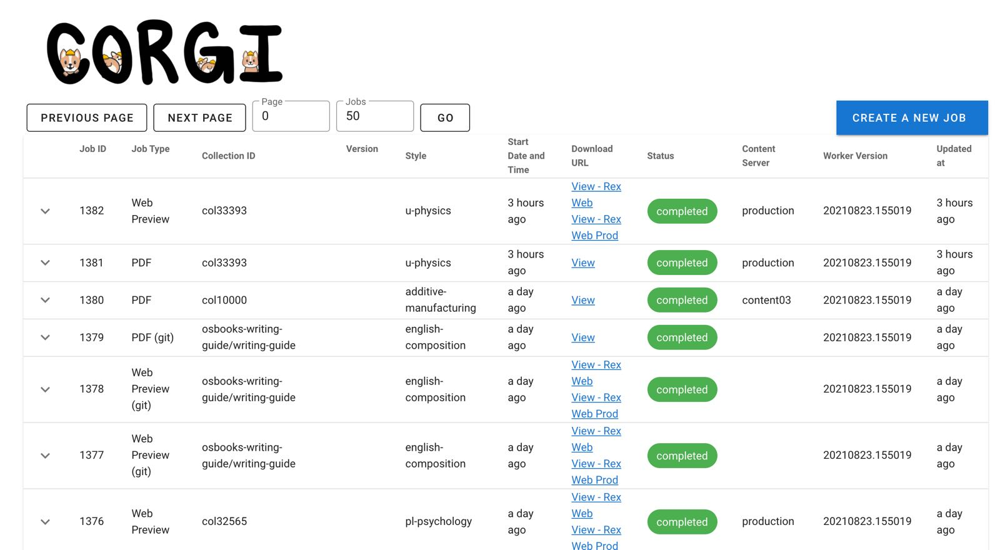
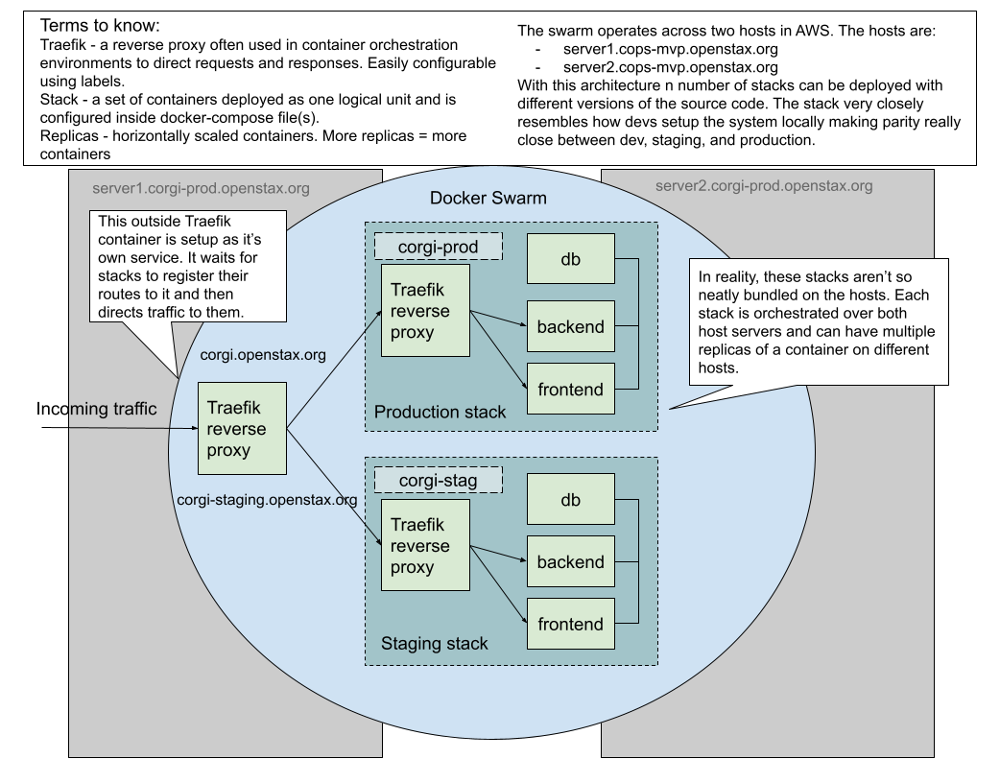

.. _operations-overview:

###############
Getting Started
###############



Why does CORGI exist?
---------------------

You'll often hear the CORGI system described simply as "CORGI" and when used in a demos
consists of a dashboard webpage that allows Content Mangers to initiate jobs that result in
content production artifacts. These artifacts are generated using Continuous Integration (CI)
pipelines that upload the artifacts to Amazon s3. The CORGI "jobs" dashboard displays job details
and also links to these artifacts so the pages can be reviewed.

At a high level CORGI consists of two main parts. We'll dig into each part and describe
more of the technology that makes up each part.

1. The `CORGI dashboard <https://corgi.openstax.org>`_ where content jobs are created and status updates are provided.
2. The `CORGI Concourse pipeline <https://concourse-v7.openstax.org>`_ that does the actual work.

CORGI Dashboard
---------------

The CORGI dashboard lists content production jobs and their status. It also allows Content Managers to create, retry,
content production jobs that produce book artifacts. This part of the system has two parts:

1. Backend - written using Python and the `FastAPI ASGI Framework <https://fastapi.tiangolo.com/>`_. The backend API is used
   by the front-end and content production pipelines to create, retrieve, or update job information.
2. Frontend - written using `nuxt.js <https://nuxtjs.org/>`_ and acts as the main dashboard interface of the CORGI system.
   You can create jobs, view queued jobs, or abort a job that's in progress. The job details can be expanded to show
   error information useful for debugging failed jobs. Essentially, this is a UI to manage a worker queue. The workers
   are Concourse pipeline build that pull from backend API and have their status displayed on the dashboard.


Docker Swarm
============
The CORGI Dashboard is designed natively to be deployed using Docker Swarm. The definition of
all the services, containers, settings, etc. is done with docker-compose files and container orchestration.
Currently, we have two hosts that orchestrate containers between them.



Everything that is needed to run the CORGI system is defined using docker-compose files and deployed as
a "Docker Stack". The database, reverse proxy, backend, and frontend all run in separate containers that
are networked together. In the image above you can see them in the green boxes labelled ``corgi-prod`` and
``corgi-stag``.

DOCKER STACK
============

**PRODUCTION EC2 INSTANCES**

* server1.corgi-prod.openstax.org
* server2.corgi-prod.openstax.org

Each of these hosts is a Docker swarm manager. When we deploy CORGI we use the ```docker stack``
command and pass in a ``docker-stack.yml`` file that represents the entire deployment.


As you'll see in the image above we have traffic in-bound into Traefik reverse-proxy service.
This service runs outside of the CORGI stack.


CORGI application and is waiting for other Traefik
The CORGI application runs the frontend and backend as separate containers. The traffic


A developer will :ref:`operations-updating-the-stack` to production (AWS EC2) where 
the docker swarm lives. 

To do this the developer will set up their local machine and use Bastion2 (Prod Server)
as a jump host to bypass the AWS server firewall to deploy, with permissions (IdentityFile) that live on 
their local machine.
